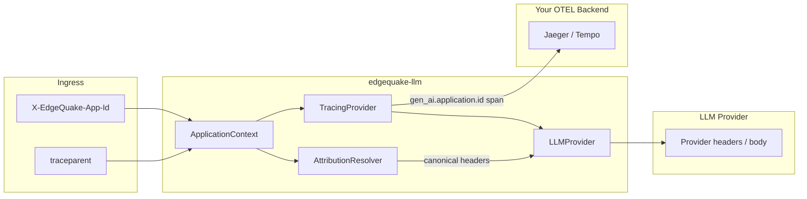

# OTEL & Observability — Role in Application Attribution

> **Core thesis**: OpenTelemetry answers *"what happened in our system?"* Provider attribution answers *"which upstream account/dashboard bucket?"* They complement each other but must not be conflated.

---

## 1. Three Planes of Identity

```text
┌─────────────────────────────────────────────────────────────────┐
│                        CALLER APPLICATION                        │
│  Sets: X-EdgeQuake-App-Id, traceparent, optional baggage        │
└────────────────────────────┬────────────────────────────────────┘
                             │
                             ▼
┌─────────────────────────────────────────────────────────────────┐
│                      edgequake-llm (SDK)                         │
│  ┌──────────────────┐  ┌──────────────────┐  ┌───────────────┐ │
│  │ TracingProvider  │  │ AttributionLayer │  │ Middleware    │ │
│  │ gen_ai.* spans   │  │ provider headers │  │ metrics/logs  │ │
│  └────────┬─────────┘  └────────┬─────────┘  └───────────────┘ │
└───────────┼─────────────────────┼───────────────────────────────┘
            │                     │
            ▼                     ▼
     OTLP → Jaeger/Tempo    Provider API → vendor dashboards
     (your observability)   (OpenAI logs, Bedrock invocation logs, …)
```

| Plane | Technology | Consumers | Carries app_id? |
|-------|------------|-----------|-----------------|
| **Distributed trace** | W3C `traceparent` / `tracestate` | Jaeger, Grafana Tempo, Datadog APM | No (trace IDs only) |
| **Business context** | W3C `baggage` | Your span processors, log enrichers | Yes (`app_id`, `tenant_id`) |
| **GenAI semantic conventions** | OTEL `gen_ai.*` attributes | LLM observability backends, Langfuse | Yes (recommended) |
| **Provider attribution** | Vendor headers/body fields | OpenAI support, AWS invocation logs, OpenRouter rankings | Yes (provider-specific) |

---

## 2. What OTEL Should Own

### 2.1 Span attributes (always — no PII)

Extend `TracingProvider` / `genai_attrs` in `src/providers/tracing.rs`:

| Attribute | Source | Standard |
|-----------|--------|----------|
| `gen_ai.application.id` | `ApplicationContext.app_id` | Proposed convention; align with [OTEL GenAI semconv](https://opentelemetry.io/docs/specs/semconv/gen-ai/gen-ai-spans/) evolution |
| `gen_ai.application.name` | `app_name` | Same |
| `gen_ai.application.url` | `app_url` | Same |
| `tenant.id` | `tenant_id` | [OTEL general conventions](https://opentelemetry.io/docs/specs/semconv/general/attributes/) |

These attributes stay **inside your telemetry** — they do not automatically become provider headers.

### 2.2 Baggage promotion (optional, opt-in)

Pattern from LiteLLM (`litellm/integrations/otel/model/baggage.py`):

```text
On LLM call span start:
  1. Read ApplicationContext
  2. Write allowlisted keys to OTEL Baggage: app_id, tenant_id
  3. BaggageSpanProcessor copies baggage → child span attributes
```

**Allowlist default**: `app_id`, `tenant_id` — **not** `end_user_id` (PII opt-in).

Reference: [OTEL Baggage spec](https://opentelemetry.io/docs/concepts/signals/baggage/)

### 2.3 W3C trace context injection

When `otel` feature enabled and active span exists:

```rust
// Pseudocode — inject into ApplicationContext.extra_headers before provider call
if let Some(span_context) = tracing_opentelemetry::OpenTelemetrySpanExt::context() {
    propagator.inject_context(&span_context, &mut header_injector);
    // Sets traceparent, tracestate
}
```

**Do not** inject `baggage` to provider HTTP unless operator explicitly enables `EDGEQUAKE_PROPAGATE_BAGGAGE_TO_PROVIDERS=true` — baggage leaks to third parties ([OTEL privacy note](https://opentelemetry.io/docs/concepts/signals/baggage)).

---

## 3. What OTEL Should NOT Own

| Anti-pattern | Why |
|--------------|-----|
| Using `traceparent` as app ID | Trace IDs rotate per request; not stable app identity |
| Putting API keys in baggage | Baggage propagates to all outbound HTTP |
| Expecting providers to read OTEL spans | Providers don't receive OTLP — only HTTP headers/body |
| Auto-injecting all span attributes as headers | Azure 431 errors; header size limits; PII leakage |
| Replacing Bedrock `requestMetadata` with baggage | AWS logs need explicit metadata field |

---

## 4. Recommended Integration Architecture



### Layer order (outermost first)

```text
RateLimitedProvider(
  CachedProvider(
    TracingProvider(
      AttributionProvider(
        OpenAIProvider
      )
    )
  )
)
```

**Rationale**: Tracing wraps attribution so spans capture both latency and resolved attribution warnings. Attribution sits inside tracing to record `AttributionWarning` events on the span.

---

## 5. OTEL vs Provider Attribution — Decision Table

| Question | Use OTEL | Use Provider Attribution |
|----------|----------|-------------------------|
| Filter traces by app in Jaeger | ✅ `gen_ai.application.id` | ❌ |
| OpenAI support ticket for timeout | ⚠️ link via span | ✅ `X-Client-Request-Id` |
| AWS Bedrock per-request cost by team | ❌ | ✅ `requestMetadata` |
| OpenRouter app leaderboard | ❌ | ✅ `HTTP-Referer` |
| Multi-tenant SaaS internal billing | ✅ metrics + spans | ⚠️ supplement with Bedrock/OpenAI fields |
| Debug single request across microservices | ✅ traceparent | ⚠️ supplement with request_id header |

---

## 6. Configuration Surface

| Env var | Default | Effect |
|---------|---------|--------|
| `EDGEQUAKE_OTEL_PROMOTE_APP_TO_BAGGAGE` | `false` | Copy app_id/tenant_id to OTEL baggage |
| `EDGEQUAKE_OTEL_INJECT_TRACE_CONTEXT` | `true` when otel feature | Inject traceparent into provider requests |
| `EDGEQUAKE_PROPAGATE_BAGGAGE_TO_PROVIDERS` | `false` | Forward baggage header to upstream (dangerous) |
| `EDGEQUAKE_CAPTURE_CONTENT` | `false` | Existing — unrelated to attribution |

---

## 7. Events & Warnings on Spans

New span events (not GenAI events):

| Event | When |
|-------|------|
| `edgequake.attribution.resolved` | Headers/body fields applied; JSON list of keys |
| `edgequake.attribution.warning` | e.g. OpenRouter missing referer, Azure body-only path used |
| `edgequake.attribution.unsupported` | Provider cannot propagate app_id |

Enables operators to audit attribution coverage in Tempo without reading debug logs.

---

## 8. Relationship to Existing `docs/observability.md`

Current stack (`TracingProvider`, `genai_events`, middleware) covers **in-process observability**. This spec adds:

1. **Ingress → ApplicationContext** parsing
2. **ApplicationContext → provider** resolution (orthogonal to spans)
3. **ApplicationContext → span attributes** bridge in `TracingProvider::record_context()`

No change to OTLP exporter setup — consumers still configure `tracing-opentelemetry` per existing docs.

---

## 9. Brainstorm Summary — OTEL Role

| Role | Verdict |
|------|---------|
| **Primary home for app_id in your stack** | ✅ Span attributes + optional baggage |
| **Transport to provider billing systems** | ❌ Must use provider matrix mechanisms |
| **Replace X-Client-Request-Id / Bedrock metadata** | ❌ Different purpose (correlation vs attribution) |
| **Bridge traceparent to provider HTTP** | ✅ Recommended when otel feature enabled |
| **Bridge baggage to provider HTTP** | ❌ Default off — privacy + size |
| **Audit attribution coverage** | ✅ Span events for warnings |

**One sentence**: OTEL tells *you* which app made a call; provider attribution headers tell *the vendor* — use both, wired from the same `ApplicationContext`, with separate resolvers and explicit safety defaults.
