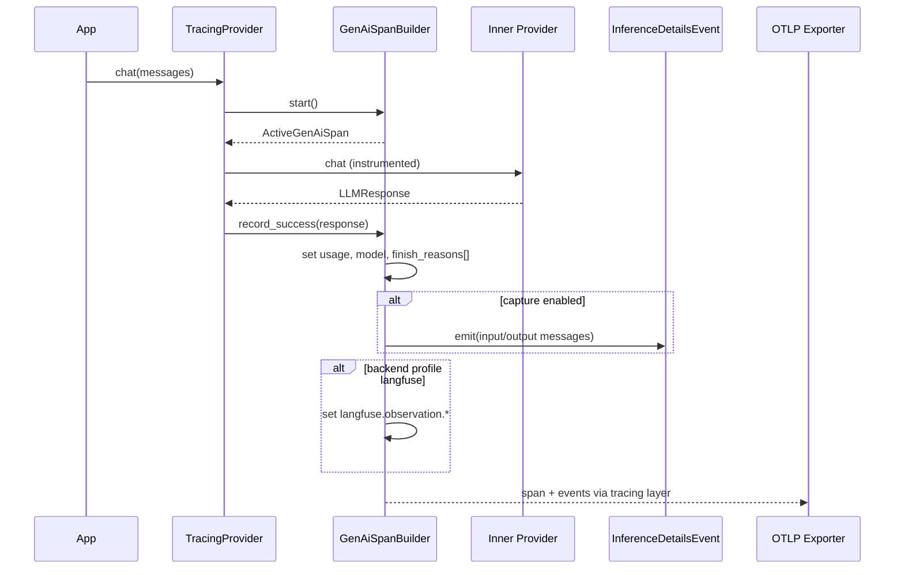

# 04 — Architecture, Gap Analysis & SOLID Design

> **Principle**: Code is law — every spec requirement maps to a module, trait, and test.  
> **Refactor scope**: Extract observability from `src/providers/tracing.rs` into a dedicated `observability` module tree.

---

## 1. As-Is vs To-Be Gap Summary

| Area | As-is (`src/providers/tracing.rs`) | Gap | To-be |
|------|-----------------------------------|-----|-------|
| Semconv version | Hardcoded v1.36 attrs | No opt-in latest | `SemConvVersion` enum + env |
| Provider attr | `gen_ai.system` only | Missing required `gen_ai.provider.name` | Registry + dual-emit |
| Span name | `gen_ai.chat` | Wrong format | `format!("{op} {model}")` |
| Operation enum | Custom values | Not in spec enum | Official mapping table |
| Content location | Span attrs `gen_ai.prompt` | Spec v1.37+ prefers events | Profile-driven |
| Message schema | `content[].text` | Wrong JSON schema | `parts[].content` |
| Finish reason | String | Spec wants array | `vec![reason]` |
| Cache tokens | `cache_hit_tokens` custom | Renamed in spec | `cache_read.input_tokens` |
| Reasoning tokens | `reasoning_tokens` custom | Renamed | `reasoning.output_tokens` |
| Streaming | No usage, no stream flag | Incomplete spans | Wire `InferenceMetrics` |
| Tool calls | No `gen_ai.tool.definitions` | Missing opt-in | Emit when capture + tools |
| Errors | Not recorded on span | Missing `error.type` | `record_error()` helper |
| Embeddings | No tracing wrapper | Missing spans | P1 `TracingEmbeddingProvider` |
| Metrics | Middleware counters only | Not OTel metrics | P2 `GenAiMetricsRecorder` |
| DRY | 6× copy-paste span blocks | Maintenance hazard | `GenAiSpanBuilder` |
| Tests | Mock provider smoke tests | No semconv conformance | JSON schema validation |

**Estimated duplicate lines to remove**: ~400 in `tracing.rs` after builder extraction.

---

## 2. Target Module Layout

```text
src/
├── observability/
│   ├── mod.rs                    # pub re-exports, feature gates
│   ├── semconv/
│   │   ├── mod.rs
│   │   ├── version.rs            # SemConvVersion, from_env()
│   │   ├── attributes.rs         # ALL gen_ai.* string constants (DRY)
│   │   └── provider_names.rs     # ProviderNameRegistry
│   ├── span/
│   │   ├── mod.rs
│   │   ├── builder.rs            # GenAiSpanBuilder
│   │   ├── operation.rs          # OperationKind enum + LLMProvider method mapping
│   │   └── backend_profile.rs    # BackendProfile shim logic
│   ├── events/
│   │   ├── mod.rs
│   │   ├── inference_details.rs  # gen_ai.client.inference.operation.details
│   │   └── messages.rs           # ChatMessage → spec JSON (parts schema)
│   ├── metrics/
│   │   ├── mod.rs                # optional: otel-metrics feature
│   │   └── recorder.rs           # gen_ai.client.token.usage histogram
│   └── error_mapping.rs          # LlmError → error.type
├── providers/
│   ├── tracing.rs                # THIN: TracingProvider delegates to observability/*
│   └── genai_events.rs           # DEPRECATED → re-export observability/events
```

### Public API surface (minimal breaking change)

```rust
// src/lib.rs — new exports
pub mod observability;

// Back-compat aliases
pub use observability::semconv::attributes as genai_attrs;  // or keep providers::tracing::genai_attrs as re-export
pub use providers::TracingProvider;  // unchanged constructor
```

---

## 3. SOLID Mapping

### Single Responsibility Principle (SRP)

| Module | Single responsibility |
|--------|----------------------|
| `ProviderNameRegistry` | Map internal provider id → `gen_ai.provider.name` |
| `GenAiSpanBuilder` | Construct span fields for one inference call |
| `InferenceDetailsEvent` | Emit one event payload |
| `MessageConverter` | ChatMessage ↔ spec JSON |
| `TracingProvider` | Decorator: lifecycle (before/after delegate) only |
| `BackendProfile` | Vendor-specific attribute shims |

`TracingProvider` **must not** contain JSON serialization logic after refactor.

### Open/Closed Principle (OCP)

```rust
pub trait SemConvEmitter {
    fn provider_key(&self) -> &'static str;
    fn system_key(&self) -> Option<&'static str>;  // legacy only
    fn finish_reason_key(&self) -> &'static str;
}

pub struct LegacyEmitter;      // v1.36
pub struct LatestEmitter;      // v1.37+ experimental

impl GenAiSpanBuilder {
    pub fn with_semconv(self, emitter: impl SemConvEmitter) -> Self;
}
```

New spec version = new `SemConvEmitter` impl; no changes to `TracingProvider` method bodies.

### Liskov Substitution Principle (LSP)

`TracingProvider<P>` must remain a transparent `LLMProvider` decorator — all capability methods delegate unchanged. Observability failures (serialization error) **must never** fail the LLM call.

### Interface Segregation Principle (ISP)

Split optional capabilities:

```rust
pub trait GenAiContentCapture { fn emit_messages(&self, ...) -> Result<()>; }
pub trait GenAiMetricsHook { fn record_token_usage(&self, ...); }  // feature-gated
```

Callers that disable capture do not pay message conversion cost (early return in builder).

### Dependency Inversion Principle (DIP)

`GenAiSpanBuilder` depends on traits, not concrete tracing internals:

```rust
pub trait SpanHandle {
    fn record_str(&self, key: &str, value: &str);
    fn record_i64(&self, key: &str, value: i64);
    fn record_event(&self, name: &str, fields: &[(&str, &str)]);
}
```

Production: `TracingSpanHandle` wrapping `tracing::Span`. Tests: `MockSpanHandle` collecting attrs.

---

## 4. GenAiSpanBuilder — Core API (code is law)

```rust
// src/observability/span/builder.rs

pub struct GenAiSpanBuilder {
    operation: OperationKind,
    provider_internal: &'static str,
    model: String,
    backend_profile: BackendProfile,
    semconv: SemConvVersion,
    application: Option<ApplicationContext>,
    request: RequestAttributes,
    stream: bool,
}

impl GenAiSpanBuilder {
    pub fn from_provider<P: LLMProvider>(provider: &P) -> Self;

    pub fn operation(mut self, op: OperationKind) -> Self;
    pub fn with_options(mut self, opts: &CompletionOptions) -> Self;
    pub fn with_messages_count(mut self, n: usize) -> Self;
    pub fn with_tools_count(mut self, n: usize) -> Self;
    pub fn streaming(mut self, yes: bool) -> Self;
    pub fn with_application(mut self, ctx: ApplicationContext) -> Self;

    /// Create tracing span with sampling-critical attrs at creation time.
    pub fn start(self) -> ActiveGenAiSpan;

    // ActiveGenAiSpan
    pub fn record_success(&self, response: &LLMResponse, metrics: Option<&InferenceMetrics>);
    pub fn record_error(&self, err: &LlmError);
}
```

### TracingProvider method body (target — ~15 lines each)

```rust
async fn chat(&self, messages: &[ChatMessage], options: Option<&CompletionOptions>) -> Result<LLMResponse> {
    let span = GenAiSpanBuilder::from_provider(self.inner())
        .operation(OperationKind::Chat)
        .with_options(options.unwrap_or_default())
        .with_messages_count(messages.len())
        .with_application(self.application_context.clone())
        .start();

    let result = self.inner().chat(messages, options).instrument(span.tracing_span()).await;

    match &result {
        Ok(response) => span.record_success(response, None, messages, options),
        Err(e) => span.record_error(e),
    }
    result
}
```

---

## 5. Data Flow Diagram



---

## 6. Integration with Existing Components

| Component | Integration |
|-----------|-------------|
| `ApplicationContext` (spec 003) | `GenAiSpanBuilder::with_application()` — unchanged fields |
| `InferenceMetrics` | Pass to `record_success(..., Some(metrics))` for TTFT |
| `MetricsLLMMiddleware` | Parallel path — no merge in P0; document duplication |
| `LoggingLLMMiddleware` | Orthogonal — logs ≠ traces |
| `CostTracker` | Future: `gen_ai.usage.cost` when provider returns cost |
| Factory | Auto-wrap with `TracingProvider` when `otel` feature + env `EDGEQUAKE_OTEL_ENABLED` |

---

## 7. Feature Flags (Cargo.toml)

```toml
[features]
default = ["otel"]
otel = ["opentelemetry", "tracing-opentelemetry"]
otel-metrics = ["otel", "opentelemetry_sdk"]  # P2
genai-schema-tests = ["jsonschema"]            # dev-dep for conformance
```

---

## 8. Deprecation Plan

| Item | Action | Timeline |
|------|--------|----------|
| `providers::genai_events` | Re-export `observability::events` | v0.11.0 |
| `genai_attrs::SYSTEM` | Deprecate comment; use `PROVIDER_NAME` | v0.11.0 |
| `gen_ai.usage.cache_hit_tokens` | Dual-emit → remove v0.13.0 | 2 releases |
| `gen_ai.usage.reasoning_tokens` | Dual-emit → remove v0.13.0 | 2 releases |
| Span name `gen_ai.chat` | Legacy profile only | v0.13.0 remove |

---

## 9. Code Anchor Cross-Reference

| Spec requirement | Implementation file |
|------------------|---------------------|
| Provider name enum | `observability/semconv/provider_names.rs` |
| Attribute constants | `observability/semconv/attributes.rs` |
| Span lifecycle | `observability/span/builder.rs` |
| Event payload | `observability/events/inference_details.rs` |
| Message JSON schema | `observability/events/messages.rs` |
| Decorator wiring | `providers/tracing.rs` (thin) |
| Backend shims | `observability/span/backend_profile.rs` |
| Error mapping | `observability/error_mapping.rs` |
| Conformance tests | `tests/genai_semconv_conformance.rs` |
| E2E OTLP | `tests/e2e_otel_genai_export.rs` |

---

## 10. What We Explicitly Do Not Change

- Provider HTTP attribution (spec 003) — separate resolver
- OTLP exporter configuration — user-owned
- `EDGECODE_CAPTURE_CONTENT` env name — backward compat (alias `OTEL_INSTRUMENTATION_GENAI_CAPTURE_MESSAGE_CONTENT` internally)
- Middleware stack ordering documented in spec 003
